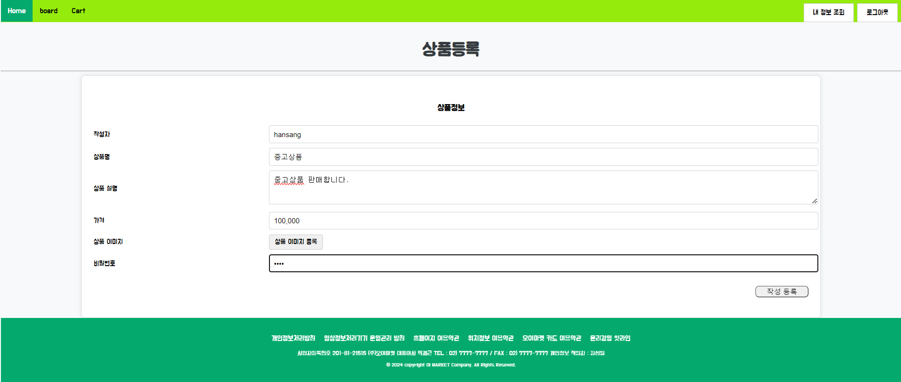
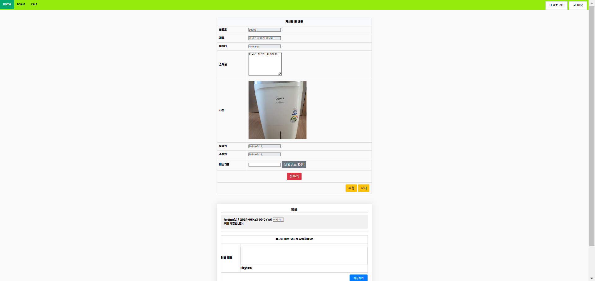
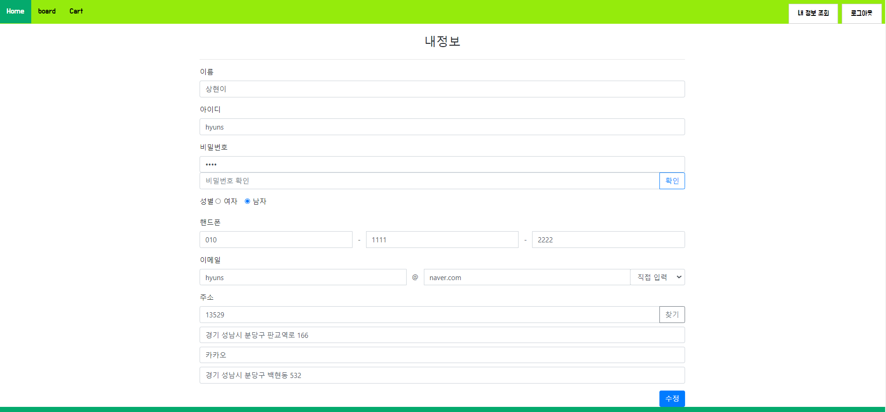

# 중고거래 게시판 (오이마켓)
- 개발기간 : 2024.06.03~2024.06.11 (5일/4명)
- 개발환경
  - OS : Window 10
  - IDE : Eclipse
  - Language : jsp, html, .. 
- 프로젝트 목적
- 스프링을 활용한 웹 페이지로 사용자들이 회원가입을 통해 물건 거래 판매 게시물을 작성할 수 있고 댓글을 통해 거래가 가능한 웹 페이지

## 기능
- 회원가입, 로그인, 로그아웃, 회원정보수정
- 구매, 댓글, 찜 목록
- 판매물건 조회

## UI
1. 메인

2. 회원가입

3. 상품등록(글 작성)

4. 판매글 목록 

5. 내용보기

6. 회원정보 수정 

7. 찜 목록 조회

